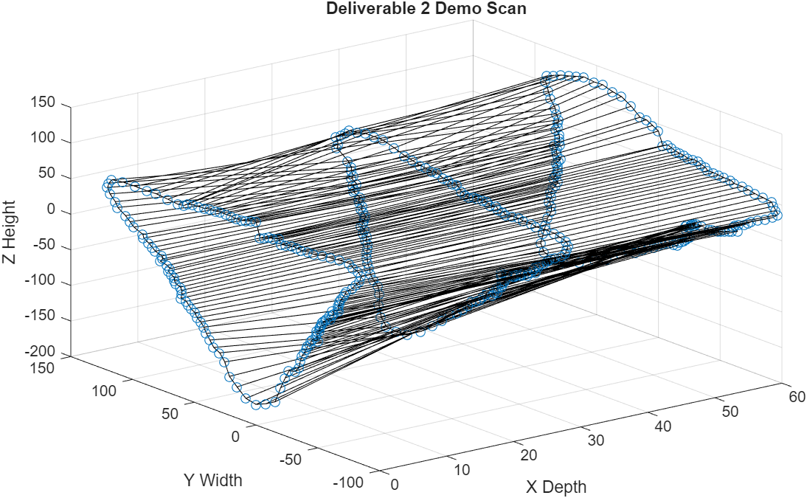

# Scan-4-Less  
*A parody of budget-brand naming (because precision shouldn't cost a fortune!)*  
 

## 📌 Overview  
3D spatial scanner using **TI MSP-EXP432E401Y (Cortex-M4)** + **VL53L1X ToF sensor**, with MATLAB 3D reconstruction.  

## 🔥 Key Features  
- **Millimeter-precision depth data** via VL53L1X sensor + automated YZ-plane stepper motor control  
- **Bare-metal firmware** in C/Assembly (I2C/UART comms, real-time motor control)  
- **MATLAB 3D room geometry maps** from raw sensor data  

---

➡ **Sequel Alert!** Check out **[Scan-4-Even-Less](https://github.com/yourusername/Scan-4-Even-Less)** for optimizations!  

## 🛠️ Hardware/Software  
| Hardware              | Software/Protocols  |  
|-----------------------|---------------------|  
| TI MSP-EXP432E401Y    | C, Assembly         |  
| VL53L1X ToF Sensor    | MATLAB              |  
| Stepper Motors (YZ)   | I2C, UART           |  

